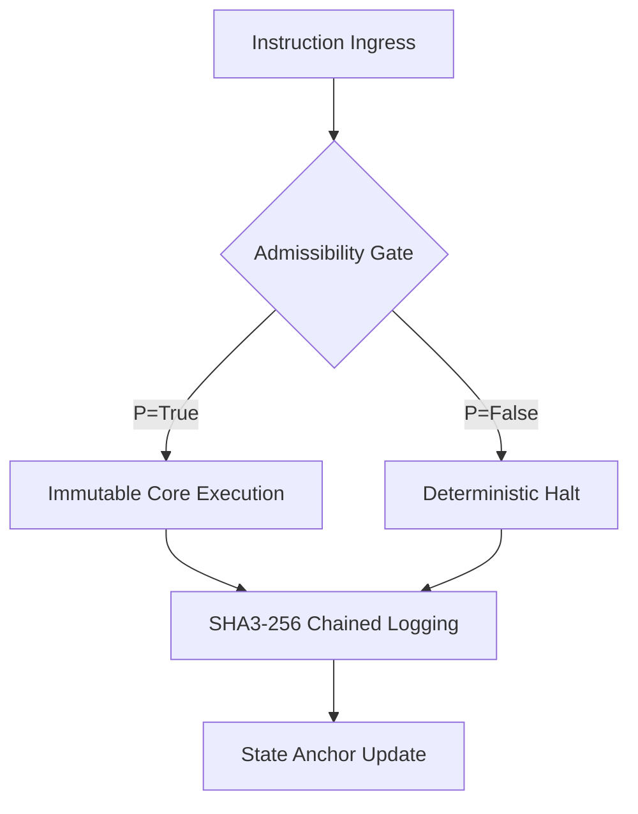

# NEXORIAN TECHNICAL WHITEPAPER v1.0
## Deterministic Governance & Cryptographic Execution Partitioning

### 1. Formal System Model
The Nexorian Kernel is modeled as a Finite State Machine (FSM) where every transition $S \to S'$ is guarded by a Boolean predicate $P$ (The Admissibility Gate).
$S' = f(S, I)$ if $P(S, I, E) = \text{True}$, else $S' = \text{Halt}$.
- $S$: System State
- $I$: Input Instruction
- $E$: Law Envelope (Policy Set)

### 2. Governance Flow & Admissibility Gate

### 3. Admissibility Gate Logic (DCE)
The Deterministic Compliance Engine (DCE) enforces constraints defined in Law Envelopes.
Example Constraint: `actor_role == 'OPERATOR' AND epoch <= limit`.
Failure to satisfy any predicate results in an immediate execution rejection.

### 4. Deterministic Execution Guarantees
- **No Probabilistic Branching**: LLM outputs are treated as raw strings until validated by the DCE.
- **Resource Exhaustion Halt**: Thermodynamic accounting (Epochs) ensures a hard-stop at the energy boundary.

### 5. Threat Model & Failure Modes
- **Adversarial Input**: Captured at the Admissibility Gate. logged as REJECTION.
- **State Drift**: Detected via SHA3-256 chain verification. Triggers a system lock.
- **Role Escalation**: Mitigated via per-request cryptographic role verification.

### 6. Cryptographic Primitives
- **Hashing**: SHA3-256 (Audit Chaining)
- **Signatures**: RSA-4096 / Ed25519 (Identity Verification)
- **Encryption**: AES-256-GCM (Payload Isolation)

### 7. Document Finality
- **Version**: 1.0.0-RELEASE
- **Spec Hash**: [CALCULATED_ON_PUSH]

---
© 2026 Nexorian Corporation. No Marketing. No Hype. Execution Only.
